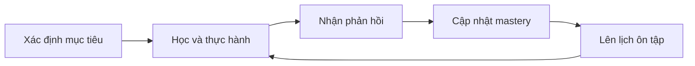

# EsquiloSpeak — Tổng quan đề xuất dự án

> Trạng thái: **Tài liệu tổng quan ở mức đề xuất**  
> Cập nhật lần cuối: **2026-07-15**  
> Phạm vi: **Ý tưởng sản phẩm, đối tượng phục vụ, nhóm nghiệp vụ và định hướng kỹ thuật**  
> Lưu ý: **Tài liệu này không phải kế hoạch triển khai, ADR hoặc cam kết lựa chọn công nghệ**

## 1. Mục đích tài liệu

Tài liệu này giúp người đọc nhanh chóng hiểu:

- EsquiloSpeak được đề xuất là sản phẩm gì.
- Sản phẩm có thể giải quyết bài toán nào và phục vụ ai.
- Những nhóm nghiệp vụ nào có thể thuộc phạm vi sản phẩm.
- Công nghệ và kiến trúc nào đáng được đánh giá sâu hơn.
- Những vấn đề nào vẫn cần nghiên cứu hoặc phê duyệt.

Các nội dung trong tài liệu đều là **đề xuất định hướng**. Việc một công nghệ hoặc kiến trúc xuất hiện tại đây không có nghĩa project đã triển khai hoặc đã chấp nhận lựa chọn đó.

Tài liệu chi tiết:

- [Phạm vi và mô hình sản phẩm](PROJECT.md).
- [Tech stack và kiến trúc hệ thống](TECH_STACK_AND_ARCHITECTURE.md).
- [Cấu trúc repository và thư mục](REPOSITORY_STRUCTURE.md).
- [Sơ đồ cây thư mục được đề xuất](assets/esquilospeak-repository-structure.png).
- ADR trong `docs/ADR-*.md` khi một quyết định dài hạn được chấp nhận.

## 2. Ý tưởng dự án

EsquiloSpeak được đề xuất là một nền tảng học ngoại ngữ đa ngôn ngữ, tập trung vào việc giúp người học tích lũy năng lực giao tiếp thông qua:

- Bài học ngắn và có mục tiêu rõ ràng.
- Active recall và spaced repetition.
- Luyện nghe, nói, đọc và viết theo ngữ cảnh.
- Phản hồi dễ hiểu và có thể hành động.
- Theo dõi tiến bộ dựa trên mastery thay vì chỉ dựa trên số bài đã hoàn thành.
- Học trong điều kiện mạng không ổn định.
- AI hỗ trợ có kiểm soát, không thay thế hoàn toàn nội dung đã được thẩm định.

Tên gọi **Esquilo** nghĩa là “con sóc” trong tiếng Bồ Đào Nha, gợi ý việc tích lũy từng phần nhỏ theo thời gian. Tagline đang được đề xuất:

> **Tích lũy từng từ, nói được từng ngày.**

## 3. Bài toán được đề xuất giải quyết

Người học ngoại ngữ thường gặp các khó khăn:

- Không biết nên học nội dung nào tiếp theo.
- Học xong nhanh quên vì thiếu ôn tập đúng thời điểm.
- Biết kiến thức nhưng khó chuyển thành phản xạ giao tiếp.
- Không hiểu nguyên nhân trả lời sai.
- Khó duy trì thói quen khi bài học dài hoặc thiếu động lực.
- Không thấy rõ năng lực nào đã tiến bộ và năng lực nào còn yếu.
- Không thể học ổn định khi mạng yếu hoặc không tiện dùng microphone.

EsquiloSpeak có thể giải quyết các vấn đề trên bằng learning path rõ ràng, review queue, feedback theo ngữ cảnh, nội dung có version và trải nghiệm offline-first.

## 4. Đối tượng phục vụ

### 4.1 Người học

- Người mới bắt đầu hoặc cần học lại từ nền tảng.
- Học sinh, sinh viên và người đi làm.
- Người học để giao tiếp, du lịch, học tập hoặc làm việc.
- Người muốn cải thiện từ vựng, phát âm và phản xạ nghe-nói.
- Người sử dụng nhiều ngôn ngữ giao diện hoặc học nhiều ngôn ngữ đích.
- Người cần accessibility hoặc chế độ học không dùng âm thanh.

### 4.2 Người vận hành nội dung và sản phẩm

- Content author và curriculum designer.
- Language, pedagogy và pronunciation reviewer.
- Publisher, moderator và support.
- Product, analytics, security và privacy operator.
- Đơn vị giáo dục hoặc giáo viên nếu mô hình tổ chức được chấp nhận sau này.

Nhóm thị trường, độ tuổi và ngôn ngữ đầu tiên vẫn cần nghiên cứu; tài liệu này không cố định một phân khúc duy nhất.

## 5. Nhóm nghiệp vụ đề xuất

| Nhóm nghiệp vụ | Phạm vi có thể bao gồm |
| --- | --- |
| Identity và profile | Tài khoản, hồ sơ, mục tiêu, cài đặt và quyền truy cập |
| Language catalog | Ngôn ngữ, locale, accent, hệ chữ và framework trình độ |
| Curriculum và content | Course, unit, lesson, exercise, media, version và publish |
| Learning session | Phiên học, câu trả lời, feedback và tiến độ |
| Assessment | Placement, checkpoint, attempt và kết quả đánh giá |
| Mastery và review | Mức độ thành thạo, spaced repetition và lịch ôn |
| Speech | Audio mẫu, ghi âm, nhận dạng giọng nói và phản hồi phát âm |
| AI assistance | Explain answer, writing feedback, hội thoại và hỗ trợ biên soạn |
| Engagement | Goal, streak, achievement, challenge và notification |
| Commerce | Subscription, entitlement, quota, refund và restore purchase |
| Administration | CMS, review, moderation, audit và support |
| Analytics | Learning outcome, chất lượng nội dung và độ tin cậy hệ thống |

Danh sách trên mô tả **capability của sản phẩm hoàn chỉnh**, không phải danh sách service và cũng không phải phạm vi của một MVP.

## 6. Mô hình học tập đề xuất

Các phương pháp đáng được đánh giá:

- **Active recall:** yêu cầu người học chủ động nhớ lại trước khi xem đáp án.
- **Spaced repetition:** lên lịch ôn dựa trên bằng chứng ghi nhớ.
- **Mastery-based progression:** mở nội dung dựa trên năng lực thay vì chỉ dựa trên completion.
- **Immediate feedback:** giải thích nguyên nhân đúng/sai phù hợp với trình độ.
- **Contextual practice:** đặt kiến thức trong tình huống sử dụng thực tế.

CEFR có thể được dùng làm khung tham chiếu cho các course phù hợp, nhưng không nên hardcode một framework cho mọi ngôn ngữ. Nguồn: [Council of Europe — CEFR Companion Volume](https://www.coe.int/en/web/common-european-framework-reference-languages/cefr-companion-volume-and-its-language-versions).

## 7. Định hướng công nghệ đề xuất

Các công nghệ dưới đây là ứng viên ưu tiên để tiếp tục đánh giá, không phải lựa chọn đã đóng:

| Phạm vi | Đề xuất ưu tiên | Lý do chính | Phương án cần cân nhắc |
| --- | --- | --- | --- |
| Mobile Android/iOS | Flutter + Dart | Một codebase UI, hỗ trợ kiến trúc ứng dụng và offline | Kotlin Multiplatform hoặc native nếu yêu cầu native chuyên sâu |
| Admin web | Next.js + TypeScript | Phù hợp CMS, form, table và server-side authorization | React SPA hoặc framework web khác nếu deployment yêu cầu |
| Core backend | Java 21 + Spring Boot + Spring Modulith | Transaction và domain module trưởng thành, phù hợp modular monolith | .NET, Go hoặc Node.js nếu năng lực đội ngũ/thử nghiệm chứng minh phù hợp hơn |
| Transactional database | PostgreSQL | Quan hệ, transaction, migration và ecosystem trưởng thành | Database khác khi có workload đặc thù đã đo được |
| Local mobile data | SQLite abstraction | Phù hợp offline cache, local outbox và transaction | Giải pháp local database khác sau benchmark |
| AI/Speech | Provider adapter trong backend trước | Giảm số runtime và deployable unit | Python/FastAPI service khi có model, GPU hoặc pipeline Python riêng |
| Cache | Redis khi có nhu cầu đo được | Cache, rate limiting và trạng thái ngắn hạn | Chưa cần cache riêng khi database đáp ứng |
| Event broker | Chưa mặc định | Tránh chi phí distributed system sớm | Kafka hoặc broker managed khi cần replay/consumer độc lập |

Nguồn định hướng: [Flutter App Architecture](https://docs.flutter.dev/app-architecture/guide), [Flutter Offline-first](https://docs.flutter.dev/app-architecture/design-patterns/offline-first), [Spring Modulith](https://docs.spring.io/spring-modulith/reference/index.html), [PostgreSQL Documentation](https://www.postgresql.org/docs/current/).

Phiên bản framework và thư viện cụ thể chỉ nên được chốt khi scaffold, sau khi kiểm tra compatibility và ghi nhận trong ADR hoặc dependency policy.

## 8. Định hướng kiến trúc đề xuất

Không dùng một tên gọi bao trùm tự đặt. Mỗi pattern được áp dụng đúng phạm vi:

| Phạm vi | Kiến trúc/pattern đề xuất |
| --- | --- |
| Backend tổng thể | Modular Monolith Architecture |
| Xác định ranh giới nghiệp vụ | Domain-Driven Design — Bounded Contexts |
| Bên trong module phức tạp | Hexagonal Architecture — Ports and Adapters |
| Side effect bất đồng bộ | Event-Driven Architecture có chọn lọc |
| Flutter mobile | MVVM + Repository + Offline-First |
| API theo client | BFF ở mức logic trong cùng backend khi thật sự cần |
| Tách service trong tương lai | Strangler Fig Pattern |

Phương án backend được ưu tiên đánh giá là một Spring Boot deployment chứa các module nghiệp vụ độc lập về code. Spring Modulith có thể kiểm tra cycle, public API và dependency được phép giữa module: [Spring Modulith Verification](https://docs.spring.io/spring-modulith/reference/verification.html).

Hexagonal Architecture giúp tách business logic khỏi REST, database và provider: [Alistair Cockburn — Hexagonal Architecture](https://alistair.cockburn.us/hexagonal-architecture).

Microservices không phải đích đến bắt buộc. Một module chỉ nên được cân nhắc tách thành service khi có nhu cầu rõ về scale, release, runtime, ownership hoặc failure isolation. Việc tách dần có thể áp dụng [Strangler Fig Pattern](https://docs.aws.amazon.com/prescriptive-guidance/latest/cloud-design-patterns/strangler-fig.html).

## 9. Nguyên tắc sản phẩm và kỹ thuật

- Xem EsquiloSpeak là sản phẩm hoàn chỉnh có khả năng phát triển lâu dài, không giới hạn tài liệu theo MVP.
- Ưu tiên learning outcome hơn chỉ số engagement bề mặt.
- Hỗ trợ đa ngôn ngữ trong model, content và UI.
- Offline và accessibility là yêu cầu nền tảng.
- AI hỗ trợ nhưng không tự xuất bản canonical content.
- Giảm số service, runtime và hạ tầng cho đến khi có nhu cầu được chứng minh.
- Không biến bounded context thành microservice một cách máy móc.
- Mọi quyết định dài hạn phải có trạng thái, lý do, trade-off và điều kiện xem lại.

## 10. Những vấn đề còn mở

- Thị trường, độ tuổi và cặp ngôn ngữ đầu tiên.
- Mô hình consumer, school/organization hoặc cả hai.
- Chuẩn đầu ra và curriculum owner cho từng language track.
- Chính sách lưu giọng nói, consent và retention.
- AI provider, quality bar, quota và cost ceiling.
- Mô hình subscription và entitlement theo nền tảng/quốc gia.
- Cloud, region, data residency và ngân sách vận hành.
- Điều kiện cụ thể để tách AI, commerce, notification hoặc realtime thành service.

## 11. Nguồn tham khảo chính

- [Spring Modulith Reference](https://docs.spring.io/spring-modulith/reference/index.html)
- [Spring Modulith — Verifying Application Module Structure](https://docs.spring.io/spring-modulith/reference/verification.html)
- [Alistair Cockburn — Hexagonal Architecture](https://alistair.cockburn.us/hexagonal-architecture)
- [Shopify — Deconstructing the Monolith](https://shopify.engineering/shopify-monolith)
- [Martin Fowler — Monolith First](https://martinfowler.com/bliki/MonolithFirst.html)
- [Flutter App Architecture](https://docs.flutter.dev/app-architecture/guide)
- [Flutter Offline-first](https://docs.flutter.dev/app-architecture/design-patterns/offline-first)
- [Microsoft Azure — Backends for Frontends](https://learn.microsoft.com/en-us/azure/architecture/patterns/backends-for-frontends)
- [AWS — Transactional Outbox Pattern](https://docs.aws.amazon.com/prescriptive-guidance/latest/cloud-design-patterns/transactional-outbox.html)
- [AWS — Strangler Fig Pattern](https://docs.aws.amazon.com/prescriptive-guidance/latest/cloud-design-patterns/strangler-fig.html)
- [W3C — WCAG 2.2](https://www.w3.org/TR/WCAG22/)

## 12. Quy tắc duy trì tài liệu

- Chỉ giữ thông tin tổng quan và đề xuất cấp cao trong file này.
- Không thêm checklist triển khai, sprint, thứ tự scaffold hoặc hướng dẫn vận hành.
- Không mô tả một công nghệ hay kiến trúc là đã chọn nếu chưa có quyết định được chấp nhận.
- Không sao chép chi tiết từ ba tài liệu chuyên biệt; liên kết đến nguồn phụ trách.
- Cập nhật trạng thái của đề xuất khi có ADR hoặc product decision được chấp nhận.

## 13. Changelog

| Ngày | Thay đổi |
| --- | --- |
| 2026-07-15 | Bổ sung liên kết đến sơ đồ cấu trúc repository đã review; không đưa chi tiết triển khai vào tài liệu tổng quan. |
