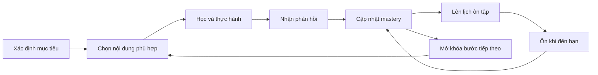

# EsquiloSpeak — Phạm vi và mô hình sản phẩm

> Trạng thái: **Đề xuất làm source of truth về sản phẩm**  
> Cập nhật lần cuối: **2026-07-14**  
> Phạm vi: **Nền tảng học ngoại ngữ hoàn chỉnh, đa ngôn ngữ, đa nền tảng**  
> Trạng thái triển khai: **Repository hiện chỉ có tài liệu, chưa có mã nguồn**

## 1. Mục đích tài liệu

Tài liệu này chi tiết hóa phần sản phẩm từ [tổng quan đề xuất EsquiloSpeak](EsquiloSpeak.md) và trả lời:

- EsquiloSpeak giải quyết vấn đề gì?
- Sản phẩm dành cho ai?
- Sản phẩm cung cấp những năng lực nào?
- Trải nghiệm học tập và nguyên tắc sản phẩm là gì?
- Thành công được đo như thế nào?
- Lộ trình và các quyết định sản phẩm còn mở là gì?

Tài liệu này không mô tả chi tiết lựa chọn công nghệ hoặc layout source code. Xem:

- [Tech stack và kiến trúc hệ thống](TECH_STACK_AND_ARCHITECTURE.md).
- [Cấu trúc repository và thư mục](REPOSITORY_STRUCTURE.md).
- [Tổng quan đề xuất EsquiloSpeak](EsquiloSpeak.md) là cổng đọc nhanh, không thay thế tài liệu sản phẩm này.

## 2. Source of truth

Thứ tự ưu tiên cho quyết định sản phẩm:

1. ADR hoặc product decision record đã được chấp nhận.
2. Tài liệu này.
3. Contract và schema đã được phê duyệt.
4. Tài liệu chuyên đề nằm trực tiếp trong `docs/` khi được tạo.
5. [EsquiloSpeak.md](EsquiloSpeak.md) để tham khảo tổng quan, không dùng thay cho quyết định chi tiết.

Không sử dụng tài liệu ngoài danh sách source of truth để suy diễn yêu cầu.

## 3. Tầm nhìn

EsquiloSpeak giúp người học tích lũy năng lực giao tiếp ngoại ngữ thông qua bài học ngắn, active recall, spaced repetition, luyện nghe-nói, phản hồi dễ hiểu và lộ trình cá nhân hóa.

Sản phẩm hướng tới một nền tảng có thể:

- Phục vụ nhiều ngôn ngữ nguồn và ngôn ngữ đích.
- Hỗ trợ người mới bắt đầu đến người học theo mục tiêu chuyên sâu.
- Hoạt động tốt trên thiết bị di động và trong điều kiện mạng không ổn định.
- Kết hợp nội dung chuyên môn, thuật toán học và AI có kiểm soát.
- Mở rộng sang assessment, chứng chỉ, subscription và tổ chức giáo dục.

## 4. Thương hiệu

### 4.1 Tên gọi

- **Esquilo**: con sóc trong tiếng Bồ Đào Nha, tượng trưng cho việc tích lũy.
- **Speak**: nói và giao tiếp.
- Tên gọi thể hiện việc tích lũy từng đơn vị kiến thức để tạo thành năng lực giao tiếp.

### 4.2 Tagline

Tagline tiếng Việt đề xuất:

> **Tích lũy từng từ, nói được từng ngày.**

Tagline tiếng Anh đề xuất:

> **Collect words. Build fluency.**

### 4.3 Tính cách thương hiệu

- Thân thiện và khích lệ.
- Kiên trì nhưng không gây áp lực.
- Thông minh, rõ ràng và thực tế.
- Không quá học thuật hoặc quá trẻ con.
- Tập trung vào tiến bộ có thể nhận thấy.

### 4.4 Linh vật

Linh vật là chú sóc đại diện cho sự tích lũy và ghi nhớ. Linh vật đóng vai trò người bạn đồng hành, hỗ trợ phản hồi, nhắc học và giải thích tiến bộ; không chỉ là yếu tố trang trí.

## 5. Bài toán sản phẩm

Người học ngoại ngữ thường gặp các vấn đề:

1. Không biết nên học nội dung nào và theo thứ tự nào.
2. Học xong nhanh quên vì thiếu active recall và ôn tập đúng thời điểm.
3. Biết từ hoặc ngữ pháp nhưng khó chuyển thành phản xạ nghe-nói.
4. Bài học dài hoặc quá khó làm mất động lực.
5. Phản hồi không giải thích nguyên nhân sai theo ngôn ngữ người học hiểu.
6. Tiến độ, mức độ thành thạo và mục tiêu đầu ra không rõ ràng.
7. Khó duy trì học tập khi mạng yếu hoặc không tiện dùng âm thanh/microphone.

EsquiloSpeak giải quyết các vấn đề này bằng learning path rõ ràng, bài học ngắn, feedback theo ngữ cảnh, review queue, tiến độ theo mastery và nhiều chế độ học phù hợp hoàn cảnh.

## 6. Người dùng

### 6.1 Nhóm người học

- Người mới bắt đầu hoặc mất gốc.
- Học sinh, sinh viên và người đi làm.
- Người học giao tiếp, phát âm, từ vựng và phản xạ.
- Người luyện mục tiêu học thuật, nghề nghiệp hoặc chứng chỉ.
- Người học nhiều ngoại ngữ hoặc sử dụng nhiều ngôn ngữ giao diện.
- Người học cần accessibility hoặc chế độ học im lặng.

### 6.2 Nhóm vận hành sản phẩm

- Content author và curriculum designer.
- Language reviewer và pronunciation reviewer.
- Teacher hoặc mentor.
- Support và moderation.
- Product, analytics và experimentation.
- Security, privacy và platform operations.
- Finance/support xử lý subscription và entitlement.

### 6.3 Job-to-be-done chính

> Khi có thời gian học, tôi muốn biết chính xác nên học hoặc ôn gì, nhận phản hồi dễ hiểu và thấy mình tiến bộ, để có thể sử dụng ngoại ngữ tự tin hơn trong tình huống thực tế.

### 6.4 Bối cảnh sử dụng

- Ở nhà, lớp học, nơi làm việc hoặc khi di chuyển.
- Phiên học từ vài phút đến thời lượng dài hơn.
- Có hoặc không có tai nghe/microphone.
- Kết nối ổn định, yếu hoặc tạm mất mạng.
- Thiết bị có cấu hình, kích thước màn hình và accessibility setting khác nhau.

## 7. Năng lực sản phẩm

| Capability | Phạm vi |
| --- | --- |
| Learning | Course, unit, lesson, exercise, feedback, progress, mastery |
| Review | Active recall, spaced repetition, review queue, scheduler versioning |
| Language | Nhiều source language, target language, locale, accent và writing system |
| Speech | Audio mẫu, recording, ASR, pronunciation feedback, conversation |
| AI | Explain answer, writing feedback, tutor, personalization có guardrail |
| Content | Authoring, review, publish, version, rollback, localization và media |
| Assessment | Placement, checkpoint, skill assessment và certificate track |
| Engagement | Goal, streak, challenge, achievement, notification và social |
| Commerce | Subscription, entitlement, quota, promotion và billing lifecycle |
| Administration | CMS, moderation, support, audit, analytics và operations |
| Organization | School/team account, class, assignment và reporting khi được chốt |

## 8. Nguyên tắc sản phẩm

1. **Learning outcome trước engagement:** không tối ưu streak hoặc time-in-app bằng cách làm giảm chất lượng học.
2. **Một bước tiếp theo rõ ràng:** người học luôn biết nên học hoặc ôn gì.
3. **Feedback có ích:** phản hồi giải thích nguyên nhân, không chỉ báo đúng/sai.
4. **Học trong nhiều hoàn cảnh:** audio và speaking quan trọng nhưng không được chặn mọi phiên học.
5. **Tiến bộ có thể giải thích:** progress và mastery phải phản ánh bằng chứng học tập.
6. **Cá nhân hóa minh bạch:** rule hoặc model ảnh hưởng lộ trình phải có lý do và cơ chế kiểm soát.
7. **Accessibility là yêu cầu nền tảng:** không phải bước bổ sung sau cùng.
8. **Privacy theo mặc định:** chỉ thu thập dữ liệu cần thiết cho mục đích đã công bố.
9. **Đa ngôn ngữ ngay trong model:** không hardcode một cặp ngôn ngữ vào schema hoặc UX.
10. **Con người chịu trách nhiệm nội dung:** AI có thể hỗ trợ nhưng không tự xuất bản canonical content.

## 9. Learning model

### 9.1 Core learning loop

### 9.2 Phương pháp

- **Active recall:** người học đưa ra đáp án trước khi xem lời giải.
- **Spaced repetition:** item được ôn dựa trên lịch và trạng thái ghi nhớ.
- **Immediate feedback:** phản hồi ngay, đúng level và theo locale của người học.
- **Mastery-based progression:** theo dõi năng lực theo learning item/concept.
- **Interleaving:** trộn kỹ năng và concept hợp lý để tăng khả năng phân biệt.
- **Contextual practice:** từ và cấu trúc được đặt trong tình huống giao tiếp.
- **Deliberate speaking/listening:** luyện có mục tiêu, feedback và cơ hội thử lại.

### 9.3 Chuẩn đầu ra

- Framework là dữ liệu và có version.
- Tiếng Anh có thể dùng CEFR làm xương sống; mỗi unit cần can-do outcome.
- Ngôn ngữ và track khác dùng framework phù hợp, không ép mọi thứ vào CEFR.
- Mỗi lesson liên kết với skill, concept, outcome, level và assessment evidence.

Tham chiếu: [CEFR Companion Volume — Council of Europe](https://www.coe.int/en/web/common-european-framework-reference-languages/cefr-companion-volume-and-its-language-versions).

### 9.4 Scheduler và mastery

- Scheduler có version và kết quả có thể giải thích.
- Mastery không chỉ dựa trên phần trăm hoàn thành.
- Dữ liệu có thể gồm correctness, response time, hint, confidence, recency và difficulty.
- Thay đổi thuật toán phải có offline evaluation, migration và rollback.

Nguồn nghiên cứu: [SM-2](https://www.super-memory.com/english/ol/sm2.htm), [Anki scheduling](https://docs.ankiweb.net/deck-options.html), [Duolingo Half-Life Regression](https://github.com/duolingo/halflife-regression).

## 10. Luồng trải nghiệm chính

### 10.1 Onboarding

1. Chọn ngôn ngữ giao diện và ngôn ngữ học.
2. Chọn mục tiêu, thời lượng và bối cảnh học.
3. Khai báo trình độ hoặc làm placement assessment.
4. Nhận lộ trình đề xuất và chỉnh sửa nếu cần.
5. Bắt đầu hoạt động học đầu tiên với ít ma sát.

### 10.2 Daily learning

1. Home hiển thị bước học phù hợp và review đến hạn.
2. Người học hoàn thành lesson, review hoặc speaking practice.
3. Hệ thống phản hồi và cập nhật mastery.
4. Kết thúc phiên hiển thị điều đã đạt và bước tiếp theo.

### 10.3 Offline và reconnect

1. Người học mở nội dung đã tải.
2. Attempt và thay đổi được lưu trên thiết bị.
3. Khi có mạng, dữ liệu đồng bộ lại mà không ghi trùng hoặc mất lịch sử.
4. Người học thấy rõ trạng thái offline, đang sync hoặc cần xử lý lỗi.

### 10.4 Content operation

1. Author tạo nội dung theo schema.
2. Reviewer kiểm tra ngôn ngữ, pedagogy, audio và cultural fit.
3. Publisher phê duyệt version.
4. Hệ thống phát hành theo course/locale/audience.
5. Analytics và report lỗi tạo vòng phản hồi cho content team.

### 10.5 Subscription

1. Người dùng xem quyền lợi và giá minh bạch.
2. Store/provider xử lý thanh toán.
3. Backend xác minh giao dịch và cấp entitlement.
4. Lifecycle renewal, cancellation, refund và restore được đồng bộ.
5. Support có audit trail để xử lý ngoại lệ.

## 11. Content lifecycle

Trạng thái chuẩn:

`draft → in_review → approved → scheduled → published → retired`

Quy tắc:

- Published version bất biến; sửa nội dung tạo version mới.
- Audio và transcript phải khớp.
- Answer, distractor và explanation có quality gate.
- Nội dung có owner, source/license và lịch sử phê duyệt.
- Có preview, staged release, rollback và content error workflow.
- AI-generated content phải được đánh dấu và review bởi người có trách nhiệm.

## 12. AI trong sản phẩm

AI có thể hỗ trợ:

- Explain answer theo level và locale.
- Writing feedback.
- Pronunciation và speaking feedback.
- Conversation practice.
- Content authoring và quality review.
- Personalization và recommendation.

Guardrail sản phẩm:

- Luôn phân biệt nội dung chuẩn với output tạo động.
- Không khẳng định chắc chắn khi model không đủ tin cậy.
- Có cơ chế report, retry, fallback và tắt tính năng.
- Quota và chi phí phải minh bạch theo gói.
- Không gửi dữ liệu cá nhân, giọng nói hoặc nội dung trẻ em vượt mục đích đã công bố.
- Model release cần evaluation và giám sát chất lượng sau phát hành.

## 13. Accessibility và inclusive design

- Hỗ trợ font scaling, screen reader và focus order.
- Không dùng màu làm tín hiệu đúng/sai duy nhất.
- Audio có transcript hoặc alternative phù hợp mục tiêu học.
- Touch target và gesture phải dễ sử dụng.
- Speaking activity không được tự ghi âm.
- Có chế độ học im lặng và trạng thái permission rõ ràng.
- Nội dung tránh định kiến, ví dụ văn hóa thiếu phù hợp hoặc ngôn ngữ gây loại trừ.

Tham chiếu: [WCAG 2.2](https://www.w3.org/TR/WCAG22/).

## 14. Đo lường thành công

### 14.1 Funnel

`acquisition → onboarding → first learning value → lesson completion → review completion → retained learning → subscription → long-term outcome`

### 14.2 Nhóm chỉ số

| Nhóm | Chỉ số tiêu biểu |
| --- | --- |
| Activation | Hoàn thành hoạt động học có giá trị đầu tiên |
| Retention | D1/D7/D30 learning retention |
| Learning | Review retention, mastery recovery, assessment improvement |
| Content | Error rate, difficulty, discrimination, completion |
| Speech | Success, latency, retry, usefulness của correction |
| AI | Quality, safety, cost trên kết quả hữu ích |
| Engagement | Goal completion, streak recovery, notification-assisted learning |
| Commerce | Conversion, renewal, refund và entitlement incident |
| Reliability | Crash-free, sync correctness và support contact rate |

Không sử dụng streak, time-in-app hoặc số câu trả lời làm north-star duy nhất vì chúng không tự chứng minh learning outcome.

### 14.3 Experimentation

Mỗi experiment cần:

- Hypothesis.
- Primary metric và guardrail metric.
- Population, assignment và exposure event.
- Sample rule và stop condition.
- Phân tích learning impact, không chỉ engagement.
- Cơ chế rollback và lưu lịch sử quyết định.

## 15. Lộ trình sản phẩm

Đây là thứ tự xây dựng nhằm kiểm soát dependency, không phải giới hạn phạm vi sản phẩm.

### Foundation

- Product decision record, curriculum framework và content schema.
- Design system, identity model, analytics taxonomy và privacy inventory.
- Hạ tầng tài liệu, contract và quality gate.

### Core learning verticals

- Language catalog, curriculum, lesson, exercise và feedback.
- Attempt, progress, mastery, review và offline sync.
- Content studio, publish workflow và support cơ bản.

### Advanced learning

- Assessment, pronunciation, conversation, AI feedback và personalization.
- Gamification, social, notification và experimentation.
- Multi-language, certification và organization features.

### Commerce và scale

- Subscription, entitlement, quota và promotion.
- Reliability hardening, cost governance và international expansion.
- Data/ML platform, model evaluation và advanced analytics.

## 16. Product decision log

| ID | Quyết định | Trạng thái |
| --- | --- | --- |
| P-001 | EsquiloSpeak là nền tảng sản phẩm hoàn chỉnh, không giới hạn theo bản thử nghiệm tối thiểu | Accepted |
| P-002 | Product model phải hỗ trợ nhiều source/target language | Proposed |
| P-003 | Learning outcome được ưu tiên hơn engagement metric | Proposed |
| P-004 | AI hỗ trợ nhưng không tự xuất bản canonical content | Proposed |
| P-005 | Offline và accessibility là yêu cầu sản phẩm nền tảng | Proposed |

Quyết định công nghệ nằm trong [tài liệu tech stack và kiến trúc](TECH_STACK_AND_ARCHITECTURE.md). Quyết định layout source nằm trong [tài liệu cấu trúc repository](REPOSITORY_STRUCTURE.md).

## 17. Câu hỏi sản phẩm cần chốt

1. Thị trường, ngôn ngữ và nhóm tuổi đầu tiên.
2. Consumer-only hay hỗ trợ school/organization ngay trong product model.
3. Guest mode và account merge.
4. Curriculum owner và content licensing.
5. Voice recording có được lưu không; consent và retention thế nào.
6. AI quality bar, quota và cost ceiling.
7. Track chứng chỉ và assessment nào được ưu tiên.
8. Subscription model theo quốc gia và platform.
9. Learning outcome nào đủ điều kiện công bố cho người dùng.
10. SLO sản phẩm và support policy.

## 18. Quy tắc duy trì

- Tài liệu này chỉ chứa quyết định sản phẩm cấp cao.
- Không lặp lại tech stack hoặc cây thư mục; sử dụng liên kết sang tài liệu tương ứng.
- Chi tiết curriculum hoặc capability được tách thành file Markdown có tên rõ ràng trực tiếp trong `docs/` khi thực sự cần.
- Quyết định dài hạn được ghi bằng ADR/product decision record.
- Mỗi tài liệu có owner, status và ngày review.
- Tài liệu được review cùng thay đổi sản phẩm và contract.

Tham khảo cách tổ chức: [Diátaxis](https://diataxis.fr/) và [Backstage TechDocs](https://backstage.io/docs/features/techdocs/creating-and-publishing/).

## 19. Changelog

| Ngày | Thay đổi |
| --- | --- |
| 2026-07-14 | Đổi vai trò từ “tài liệu chung” thành tài liệu chuyên biệt về phạm vi và mô hình sản phẩm. |
| 2026-07-14 | Đồng bộ vai trò của `EsquiloSpeak.md` và loại bỏ tham chiếu tới các thư mục tài liệu không tồn tại. |
| 2026-07-14 | Tách tài liệu chung về sản phẩm khỏi tài liệu công nghệ/kiến trúc và cấu trúc repository. |
