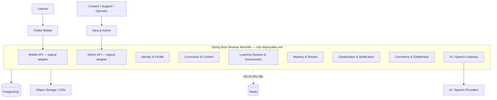

# EsquiloSpeak — Tech stack và kiến trúc hệ thống

> Trạng thái: **Đề xuất kỹ thuật; chỉ trở thành quyết định khi có ADR được chấp nhận**  
> Cập nhật lần cuối: **2026-07-15**  
> Phạm vi: **Technology selection, architecture, data, integration, security và operations**  
> Trạng thái triển khai: **Repository chưa có application code để xác nhận kiến trúc thực tế**

## 1. Mục đích tài liệu

Tài liệu này:

- Đề xuất tech stack phù hợp với phạm vi EsquiloSpeak.
- Gọi đúng tên các kiến trúc và pattern đã được công nhận.
- Xác định pattern nào được áp dụng ở phạm vi nào.
- Phân biệt baseline cần thiết với công nghệ chỉ thêm khi có điều kiện.
- Ghi lại trade-off, rủi ro và thời điểm cần xem lại.

Phạm vi sản phẩm nằm trong [PROJECT.md](PROJECT.md). Cấu trúc source code nằm trong [REPOSITORY_STRUCTURE.md](REPOSITORY_STRUCTURE.md). Tóm tắt dành cho người đọc mới nằm trong [EsquiloSpeak.md](EsquiloSpeak.md).

## 2. Trạng thái quyết định

Các từ khóa được dùng thống nhất:

| Trạng thái | Ý nghĩa |
| --- | --- |
| Đề xuất ưu tiên | Phương án hiện được đánh giá phù hợp nhất, nhưng chưa phải cam kết triển khai |
| Thay thế | Phương án hợp lệ nếu điều kiện project thay đổi |
| Có điều kiện | Chỉ bổ sung khi requirement, benchmark hoặc chi phí chứng minh nhu cầu |
| Đã chấp nhận | Chỉ dùng khi có ADR `Accepted` tương ứng |

Không suy diễn một lựa chọn là “đã dùng” chỉ vì nó xuất hiện trong tài liệu hoặc có thư mục scaffold.

## 3. Tiêu chí lựa chọn

1. Phù hợp ứng dụng học tập có nhiều interaction, audio, speech và offline.
2. Quản lý được domain content, learning, review, mastery, commerce và AI.
3. Dễ học, test, debug và vận hành đối với nguồn lực phát triển hiện tại.
4. Có tài liệu chính thức, ecosystem trưởng thành và lộ trình bảo trì rõ.
5. Giảm số runtime, deployable unit và dịch vụ hạ tầng không cần thiết.
6. Có đường tiến hóa khi tải, ownership hoặc failure isolation thay đổi.
7. Ưu tiên standard tại boundary: OpenAPI, OIDC và OpenTelemetry.
8. Chọn managed service khi chi phí vận hành thấp hơn tự quản lý.
9. Không sao chép kiến trúc quy mô lớn khi project chưa có cùng constraint.
10. Mọi lựa chọn phải có điều kiện xem lại.

## 4. Kiến trúc được đề xuất theo phạm vi

Không sử dụng tên gọi “hybrid service-oriented architecture”. Thay vào đó, kiến trúc được mô tả bằng các pattern có định nghĩa rõ:

| Phạm vi | Kiến trúc/pattern đề xuất | Vai trò |
| --- | --- | --- |
| Backend tổng thể | **Modular Monolith Architecture** | Một backend deployment, chia thành module nghiệp vụ có boundary |
| Ranh giới nghiệp vụ | **Domain-Driven Design — Bounded Contexts** | Xác định model, ngôn ngữ và ownership theo domain |
| Nội bộ module phức tạp | **Hexagonal Architecture — Ports and Adapters** | Cô lập domain/use case khỏi REST, database và provider |
| Side effect bất đồng bộ | **Event-Driven Architecture**, có chọn lọc | Giảm coupling giữa module khi không cần kết quả tức thời |
| Mobile | **MVVM + Repository + Offline-First** | Tách UI state, data access và đồng bộ local/remote |
| API theo client | **Backends for Frontends**, ở mức logic khi cần | Tạo contract phù hợp mobile/admin mà chưa cần service riêng |
| Tách service về sau | **Strangler Fig Pattern** | Tách dần module có lý do rõ, tránh chuyển đổi big-bang |

Nguồn nền tảng:

- [Spring Modulith Reference](https://docs.spring.io/spring-modulith/reference/index.html).
- [Spring Modulith — Verifying Application Module Structure](https://docs.spring.io/spring-modulith/reference/verification.html).
- [Alistair Cockburn — Hexagonal Architecture](https://alistair.cockburn.us/hexagonal-architecture).
- [Microsoft — Domain analysis for microservices](https://learn.microsoft.com/en-us/azure/architecture/microservices/model/domain-analysis).
- [Martin Fowler — Monolith First](https://martinfowler.com/bliki/MonolithFirst.html).
- [Shopify — Deconstructing the Monolith](https://shopify.engineering/shopify-monolith).

## 5. Kiến trúc hệ thống mục tiêu

### 5.1 Baseline được đề xuất



Baseline gồm:

- Hai client: mobile và admin web.
- Một core backend deployable theo Modular Monolith.
- PostgreSQL làm transactional source of truth.
- Object storage cho media khi bắt đầu có audio/image production.
- AI/speech được truy cập qua port và provider adapter.

Redis, event broker, Kubernetes, OpenSearch, warehouse riêng và các service độc lập không thuộc baseline mặc định.

### 5.2 Module nghiệp vụ đề xuất

| Module | Trách nhiệm chính |
| --- | --- |
| `identity-profile` | Subject mapping, profile, role và preference |
| `language-catalog` | Language, locale, accent, script và framework metadata |
| `curriculum-content` | Course, unit, lesson, exercise, version và publishing |
| `learning-session` | Phiên học, activity và trạng thái thực hiện |
| `assessment` | Attempt, scoring và assessment result |
| `mastery` | Bằng chứng và mức độ thành thạo |
| `review-scheduler` | Review queue và spaced-repetition scheduling |
| `gamification` | XP, streak, achievement và challenge |
| `commerce-entitlement` | Subscription state, quota và entitlement |
| `notification` | Preference, template và yêu cầu gửi thông báo |
| `admin-audit` | Administrative action, moderation và audit trail |
| `ai-gateway` | Hợp đồng AI/speech, quota, safety và provider adapter |

Đây là ranh giới khởi điểm cần được kiểm chứng bằng use case. Không tách một module chỉ vì có một bảng riêng; cũng không biến mỗi module thành service.

### 5.3 Quy tắc module

- Module khác chỉ gọi public application API hoặc consume event công khai.
- Không truy cập repository, entity hoặc table nội bộ của module khác.
- Không tạo dependency cycle.
- Không tạo `common-domain` chứa aggregate dùng chung.
- Spring Modulith verification phải kiểm tra cycle, API access và allowed dependency.
- Module test dùng slice phù hợp thay vì luôn khởi động toàn hệ thống.
- Dữ liệu có ownership logic theo module dù baseline có thể dùng chung PostgreSQL database.

[Spring Modulith verification](https://docs.spring.io/spring-modulith/reference/verification.html) hỗ trợ kiểm tra no-cycle, API-only access và allowed dependencies.

### 5.4 Hexagonal Architecture trong module

Module có business rule phức tạp có thể dùng:

```text
<module>/
├── domain/              # Aggregate, value object, policy và business invariant
├── application/         # Use case, orchestration và transaction boundary
├── ports/
│   ├── in/              # Command/query contract
│   └── out/             # Persistence/provider/event contract
└── adapters/
    ├── in/              # REST, scheduler, event listener
    └── out/             # PostgreSQL, storage, AI provider, message broker
```

Không bắt buộc tạo đủ package/interface cho module CRUD đơn giản. Mục tiêu là bảo vệ business rule, không phải tăng số lớp. Nguồn gốc pattern: [Hexagonal Architecture](https://alistair.cockburn.us/hexagonal-architecture).

## 6. Giao tiếp và event

### 6.1 Trong modular monolith

- Gọi application API đồng bộ khi caller cần kết quả ngay.
- Dùng application/domain event cho side effect không cần hoàn thành cùng response.
- Ưu tiên Spring application event/Spring Modulith event trước broker ngoài tiến trình.
- Handler phải có ownership, lỗi quan sát được và chiến lược retry phù hợp.

Ví dụ: `LessonCompleted` có thể kích hoạt cập nhật review, gamification và analytics mà không làm các module truy cập repository của nhau.

Tham khảo: [Spring Modulith — Working with Application Events](https://docs.spring.io/spring-modulith/reference/events.html).

### 6.2 Khi nào thêm message broker

Chỉ đánh giá Kafka hoặc broker managed khi có một hay nhiều điều kiện:

- Consumer được deploy độc lập.
- Cần durable replay hoặc lưu event lâu dài.
- Throughput bất đồng bộ đã đo vượt khả năng xử lý hiện tại.
- Có nhiều hệ thống ngoài tiến trình cùng consume.
- Broker mang lại giá trị lớn hơn chi phí vận hành, schema governance và debugging.

Khi phát event ra broker, áp dụng Transactional Outbox và consumer idempotent để xử lý dual-write/at-least-once delivery: [AWS — Transactional Outbox Pattern](https://docs.aws.amazon.com/prescriptive-guidance/latest/cloud-design-patterns/transactional-outbox.html).

## 7. API architecture

- Mobile/admin dùng REST/JSON và OpenAPI cho contract công khai.
- Business authorization nằm trong backend, không chỉ ở client hoặc gateway.
- Mutation offline/quan trọng có idempotency key.
- Error contract có code ổn định, trace ID và retryability.
- Cursor pagination cho collection tăng liên tục.
- API version chỉ tăng khi có breaking change không thể tương thích.
- gRPC/WebSocket chỉ thêm cho streaming hoặc workload đã chứng minh.

BFF được áp dụng ở mức logical adapter như `/api/mobile` và `/api/admin` trong cùng backend. Không tạo `client-api` deployable riêng ở baseline. BFF service độc lập chỉ phù hợp khi nhu cầu client, ownership hoặc release khác biệt đủ lớn; Microsoft cũng nêu chi phí thêm network hop và vận hành: [Backends for Frontends Pattern](https://learn.microsoft.com/en-us/azure/architecture/patterns/backends-for-frontends).

Tham khảo contract: [OpenAPI Specification](https://spec.openapis.org/oas/latest.html).

## 8. Tech stack đề xuất

### 8.1 Mobile

| Phương án | Đánh giá |
| --- | --- |
| Flutter + Dart | **Đề xuất ưu tiên** cho Android/iOS; một UI codebase, tài liệu kiến trúc và offline chính thức |
| Kotlin Multiplatform | Thay thế nếu cần chia sẻ domain/data nhưng ưu tiên UI native |
| Native Kotlin + Swift | Thay thế khi integration, UX hoặc hiệu năng native chuyên sâu biện minh hai codebase |
| React Native | Hợp lệ nếu đội ngũ có lợi thế React/TypeScript rõ ràng |

Định hướng Flutter: feature-first, MVVM, Repository/Service và Offline-First. Domain/use-case layer chỉ thêm khi logic đủ phức tạp. Nguồn: [Flutter App Architecture](https://docs.flutter.dev/app-architecture/guide), [Flutter Offline-first](https://docs.flutter.dev/app-architecture/design-patterns/offline-first).

### 8.2 Admin web

**Đề xuất ưu tiên:** Next.js + TypeScript + React cho CMS/support/operations vì phù hợp form, table, accessibility và server-side boundary.

Không cố định phiên bản tại tài liệu này; chọn stable supported release khi scaffold và ghi trong dependency policy. Nguồn: [Next.js App Router](https://nextjs.org/docs/app), [Next.js Production Checklist](https://nextjs.org/docs/app/guides/production-checklist).

### 8.3 Core backend

**Đề xuất ưu tiên:**

- Java 21 LTS làm runtime baseline.
- Spring Boot trên release line ổn định tương thích Java 21.
- Spring Modulith để mô hình hóa và kiểm tra application module.
- Gradle Kotlin DSL cho build.
- Spring Security và PostgreSQL driver.
- Flyway hoặc Liquibase được quyết định khi scaffold, không dùng đồng thời nếu không có lý do.

Java 21 phù hợp với môi trường phát triển đã xác nhận và giảm rủi ro compatibility so với non-LTS. Phiên bản Spring Boot/Modulith cụ thể phải theo compatibility matrix tại thời điểm triển khai: [Spring Boot System Requirements](https://docs.spring.io/spring-boot/system-requirements.html), [Spring Modulith Reference](https://docs.spring.io/spring-modulith/reference/index.html).

### 8.4 AI và speech

Baseline ưu tiên:

- Định nghĩa `AiPort`, `SpeechToTextPort`, `TextToSpeechPort` hoặc contract tương đương trong module phù hợp.
- Provider-specific code nằm trong outbound adapter.
- Canonical learning/progress data vẫn do core backend sở hữu.
- Có timeout, quota, redaction, audit và fallback.

Python + FastAPI là **lựa chọn có điều kiện**, chỉ tách thành service khi có custom model, pipeline Python, GPU, model lifecycle hoặc scaling/failure isolation riêng. Nguồn khi lựa chọn FastAPI: [FastAPI Deployment Concepts](https://fastapi.tiangolo.com/deployment/concepts/).

### 8.5 Data và storage

| Nhu cầu | Baseline/điều kiện |
| --- | --- |
| Transactional data | PostgreSQL — baseline |
| Mobile local data | SQLite abstraction — baseline cho offline |
| Media binary | S3-compatible object storage + CDN khi có media production |
| Cache/rate limit | Redis khi có use case và measurement |
| Search | PostgreSQL full-text trước; OpenSearch khi giới hạn được đo |
| Vector retrieval | pgvector trước nếu cần; vector store riêng khi có giới hạn |
| Analytics | Event table/export trước; warehouse riêng khi volume và nhu cầu phân tích yêu cầu |
| Event backbone | Broker managed chỉ theo điều kiện tại mục 6.2 |

PostgreSQL, Redis, search index hoặc broker có vai trò khác nhau; cache/projection không phải source of truth. Nguồn: [PostgreSQL](https://www.postgresql.org/docs/current/), [Redis Documentation](https://redis.io/docs/latest/), [Apache Kafka Documentation](https://kafka.apache.org/documentation/).

### 8.6 Identity

- OAuth 2.0/OpenID Connect cho federation.
- Mobile dùng Authorization Code với PKCE.
- Backend kiểm tra token và authorization server-side.
- Ưu tiên managed identity provider; chỉ self-host khi data control/cost/compliance biện minh.
- Admin cần MFA hoặc passkey khi provider hỗ trợ.

Nguồn: [OpenID Connect Core](https://openid.net/specs/openid-connect-core-1_0.html), [RFC 7636 — PKCE](https://www.rfc-editor.org/rfc/rfc7636).

### 8.7 Delivery và observability

- Local development: Docker Compose khi bắt đầu có dependency chạy được.
- Production: container hoặc managed application platform trước; Kubernetes chỉ khi số workload và yêu cầu vận hành biện minh.
- Infrastructure as Code: Terraform/OpenTofu-compatible approach khi có cloud environment.
- Telemetry: OpenTelemetry API/SDK và Collector khi cần pipeline thống nhất.
- Observability là capability có điều kiện nhưng có thể xuất hiện sớm ngay khi Modular Monolith cần trace, metric, log, dashboard hoặc alert tập trung; không phụ thuộc Kubernetes hay GitOps.

Nguồn: [Docker Compose](https://docs.docker.com/compose/), [Kubernetes Production Environment](https://kubernetes.io/docs/setup/production-environment/), [OpenTelemetry](https://opentelemetry.io/docs/what-is-opentelemetry/), [OpenTelemetry — Observability primer](https://opentelemetry.io/docs/concepts/observability-primer/).

Cloud provider chưa được đề xuất cố định vì thiếu thị trường, region, budget, residency và expected workload.

## 9. Offline và đồng bộ

- UI đọc từ repository hợp nhất local/remote data source.
- Content package có immutable version, manifest và checksum.
- Mutation offline có client event ID và local outbox.
- Server deduplicate và trả canonical version/sync cursor.
- Attempt ưu tiên append-only để tránh mất lịch sử.
- Conflict policy được xác định theo loại dữ liệu, không dùng last-write-wins toàn cục.
- Scheduler và content version phải cho phép migrate/replay.

Đây là yêu cầu kiến trúc nền tảng, không phải tính năng bổ sung về sau. Nguồn: [Flutter Offline-first](https://docs.flutter.dev/app-architecture/design-patterns/offline-first).

## 10. Security và privacy

- OAuth/OIDC, PKCE, least privilege và server-side authorization.
- Secret không nằm trong source, image, mobile binary hoặc log.
- TLS in transit; encryption, backup và retention theo data class.
- Consent riêng cho microphone, voice và AI processing.
- Admin action và content publish có audit trail.
- Không đưa token, raw recording hoặc PII không cần thiết vào event/telemetry.
- Threat model cho auth, sync, audio, AI, commerce và CMS.

Baseline tham khảo: [OWASP MASVS](https://mas.owasp.org/MASVS/), [OWASP ASVS](https://owasp.org/www-project-application-security-verification-standard/), [W3C WCAG 2.2](https://www.w3.org/TR/WCAG22/).

## 11. Reliability và quality gates

Ưu tiên user journey:

- Không mất attempt đã được xác nhận.
- Sync không ghi trùng và có thể phục hồi.
- Entitlement không được cấp/thu hồi sai.
- Learning đã cache vẫn hoạt động khi AI, analytics hoặc notification lỗi.
- Content publish có version và rollback.

Quality gates đề xuất:

| Phạm vi | Kiểm tra |
| --- | --- |
| Backend domain | Unit/property-based test cho mastery, scheduler và entitlement |
| Module boundary | Spring Modulith verification và module integration test |
| Persistence | Migration, concurrency, idempotency và Testcontainers khi có code |
| Mobile | Unit/widget, accessibility, offline/reconnect và integration |
| Web | Lint, typecheck, authorization và E2E |
| Contract | OpenAPI lint và backward compatibility |
| AI | Evaluation dataset, safety, latency và cost regression |
| Operations | Backup/restore, dependency outage và smoke test khi có environment |

SLO chỉ được chốt sau khi có user journey, telemetry và benchmark; không ghi số phần trăm giả định như cam kết production.

## 12. Tiến hóa sang service độc lập

Một module chỉ được cân nhắc tách khi có bằng chứng về:

- Scaling độc lập.
- Runtime hoặc hạ tầng chuyên biệt.
- Release cadence/ownership độc lập.
- Failure isolation cần thiết.
- Security/compliance boundary khác biệt.
- Chi phí vận hành phân tán có thể chấp nhận.

Tách dần bằng [Strangler Fig Pattern](https://docs.aws.amazon.com/prescriptive-guidance/latest/cloud-design-patterns/strangler-fig.html), giữ contract rõ và tránh shared database write. Microservices là phương án tiến hóa có điều kiện, không phải đích đến bắt buộc.

## 13. Các lựa chọn không thuộc baseline

| Lựa chọn | Vì sao chưa mặc định | Khi xem lại |
| --- | --- | --- |
| `client-api` service riêng | Thêm network hop và deployment | Client/team/release khác biệt rõ |
| `ai-speech-processing` service | Tăng runtime và vận hành | Custom ML/GPU/pipeline Python |
| `realtime-conversation` service | Chưa có benchmark kết nối/latency | Streaming conversation trở thành workload chính |
| `billing-integration` service | Core entitlement và scheduled reconciliation đáp ứng giai đoạn đầu | Compliance/provider integration/failure isolation riêng |
| `notification-delivery` service | Có thể xử lý qua module/job | Fan-out lớn hoặc provider failure cần cô lập |
| `billing-reconciliation` worker | Scheduled job trong core module đơn giản hơn | Scale, retry, queue, security hoặc failure isolation yêu cầu tách |
| Kafka | Schema/replay/operations phức tạp | Consumer độc lập hoặc durable replay |
| Kubernetes/GitOps | Chi phí nền tảng cao | Nhiều workload và team vận hành đủ năng lực |
| OpenSearch/warehouse riêng | Tăng hệ thống dữ liệu | PostgreSQL/export không đáp ứng workload đo được |

## 14. Architecture decision log

| ID | Đề xuất | Trạng thái |
| --- | --- | --- |
| A-001 | Flutter cho mobile Android/iOS | Proposed |
| A-002 | Next.js/TypeScript cho admin web | Proposed |
| A-003 | Java 21 + Spring Boot + Spring Modulith cho core | Proposed |
| A-004 | Modular Monolith là kiến trúc backend chính | Proposed |
| A-005 | DDD Bounded Contexts xác định module boundary | Proposed |
| A-006 | Hexagonal Architecture cho module nghiệp vụ phức tạp | Proposed |
| A-007 | PostgreSQL là transactional source of truth | Proposed |
| A-008 | REST/OpenAPI cho client contract | Proposed |
| A-009 | Event-driven nội bộ có chọn lọc; broker chỉ khi đủ điều kiện | Proposed |
| A-010 | AI/speech dùng provider adapter trước, Python service có điều kiện | Proposed |
| A-011 | MVVM + Repository + Offline-First cho Flutter | Proposed |
| A-012 | Strangler Fig cho việc tách service trong tương lai | Proposed |

Mỗi đề xuất dài hạn cần ADR riêng trước khi được ghi là `Accepted`.

## 15. Nguồn tham khảo

### Kiến trúc

- [Spring Modulith Reference](https://docs.spring.io/spring-modulith/reference/index.html)
- [Spring Modulith Verification](https://docs.spring.io/spring-modulith/reference/verification.html)
- [Spring Modulith Events](https://docs.spring.io/spring-modulith/reference/events.html)
- [Alistair Cockburn — Hexagonal Architecture](https://alistair.cockburn.us/hexagonal-architecture)
- [Shopify — Deconstructing the Monolith](https://shopify.engineering/shopify-monolith)
- [Martin Fowler — Monolith First](https://martinfowler.com/bliki/MonolithFirst.html)
- [Microsoft — Backends for Frontends](https://learn.microsoft.com/en-us/azure/architecture/patterns/backends-for-frontends)
- [AWS — Transactional Outbox](https://docs.aws.amazon.com/prescriptive-guidance/latest/cloud-design-patterns/transactional-outbox.html)
- [AWS — Strangler Fig](https://docs.aws.amazon.com/prescriptive-guidance/latest/cloud-design-patterns/strangler-fig.html)

### Application và platform

- [Flutter App Architecture](https://docs.flutter.dev/app-architecture/guide)
- [Flutter Offline-first](https://docs.flutter.dev/app-architecture/design-patterns/offline-first)
- [Next.js App Router](https://nextjs.org/docs/app)
- [Spring Boot System Requirements](https://docs.spring.io/spring-boot/system-requirements.html)
- [PostgreSQL Documentation](https://www.postgresql.org/docs/current/)
- [OpenAPI Specification](https://spec.openapis.org/oas/latest.html)
- [OpenID Connect Core](https://openid.net/specs/openid-connect-core-1_0.html)
- [OpenTelemetry](https://opentelemetry.io/docs/what-is-opentelemetry/)

### Quality và security

- [OWASP MASVS](https://mas.owasp.org/MASVS/)
- [OWASP ASVS](https://owasp.org/www-project-application-security-verification-standard/)
- [W3C WCAG 2.2](https://www.w3.org/TR/WCAG22/)
- [Google SRE — Service Level Objectives](https://sre.google/sre-book/service-level-objectives/)

## 16. Changelog

| Ngày | Thay đổi |
| --- | --- |
| 2026-07-15 | Chuẩn hóa tên service theo extracted workload; xác định reconciliation worker là lựa chọn có điều kiện; tách mức trưởng thành của observability khỏi Kubernetes/GitOps. |
| 2026-07-14 | Thay thuật ngữ tự đặt bằng Modular Monolith, DDD, Hexagonal Architecture và các pattern có nguồn rõ ràng; chuyển service/hạ tầng phân tán thành lựa chọn có điều kiện. |
| 2026-07-14 | Tách tech stack và kiến trúc khỏi tài liệu sản phẩm và cấu trúc repository. |
